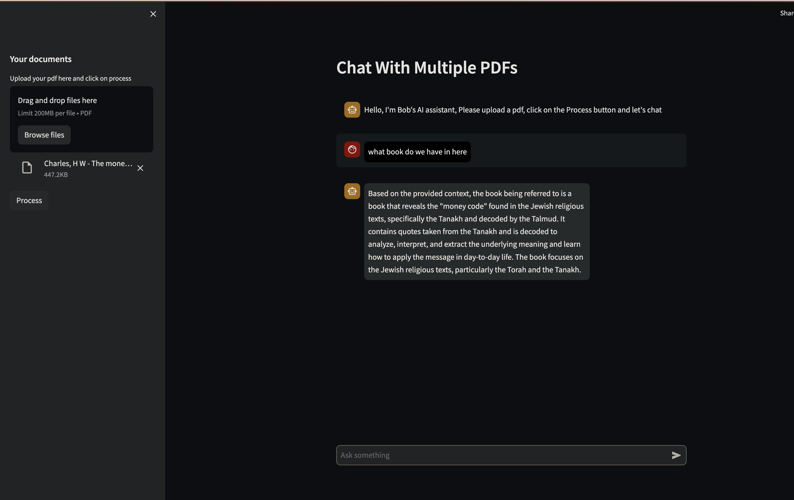

# Research Assistant 
The recent popularity of conversational AI has given us an idea of what we can expect from the likes of ChatGPT. What about chatting with your own documents without relying on ChatGPT?. This research assistance is a Python application that allows you to chat with your own PDF.You can ask any question using natural language and the application will respond based __ONLY__ on the context of your PDF.

## [Access the AI bot here](https://bobs-ai-research-assistant.streamlit.app/)


## How It Works
------------


The application follows these steps to provide responses to your questions:

1. PDF Loading: The app reads multiple PDF documents and extracts their text content.

2. Text Chunking: The extracted text is divided into smaller chunks that can be processed effectively.

3. Language Model: The application utilizes text embeddings to generate vector representations (embeddings) of the text chunks in memory.

4. Similarity Matching: When you ask a question, the app compares it with the text chunks and identifies the most semantically similar ones.

5. Response Generation: The selected chunks are passed to the language model, which generates a response based on the relevant content of the PDF.

## Dependencies and Installation
----------------------------
To install the MultiPDF Chat App, please follow these steps:

1. Clone the repository to your local machine.

2. Install the required dependencies by running the following command:
   ```
   pip install -r requirements.txt
   ```

3. Obtain an API key from OpenAI and add it to the `.env` file in the project directory.
```commandline
OPENAI_API_KEY=your_secrit_api_key
```

## Usage
-----
To use the  App, follow these steps:

1. Ensure that you have installed the required dependencies and added the OpenAI API key to the `.env` file.

2. Run the `app.py` file using the Streamlit CLI. Execute the following command:
   ```
   streamlit run app.py
   ```

3. The application will launch in your default web browser, displaying the user interface.

4. Load a PDF documents into the app by following the provided instructions.

5. Ask questions in natural language about the loaded PDFs using the chat interface.

## The App Interface
